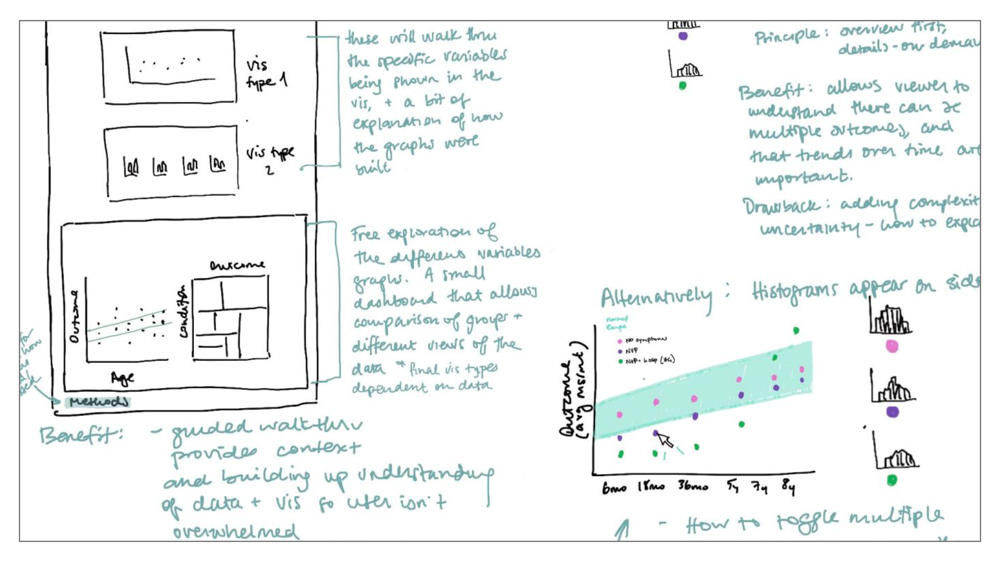
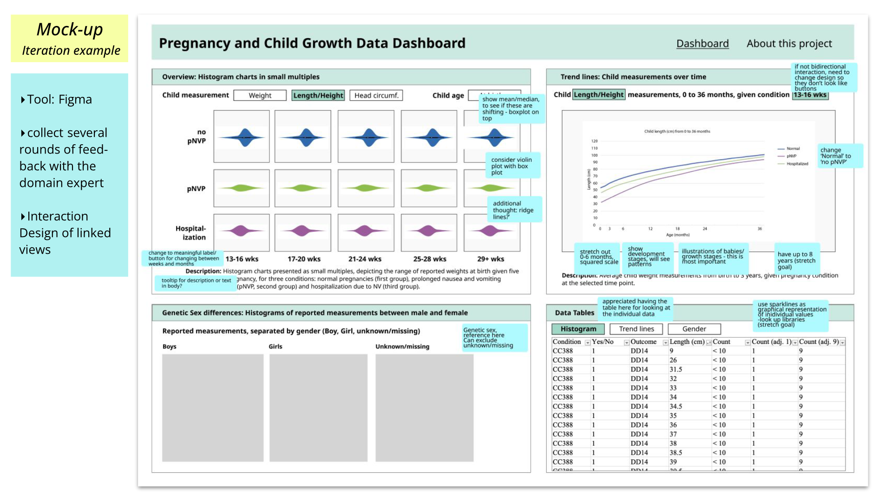
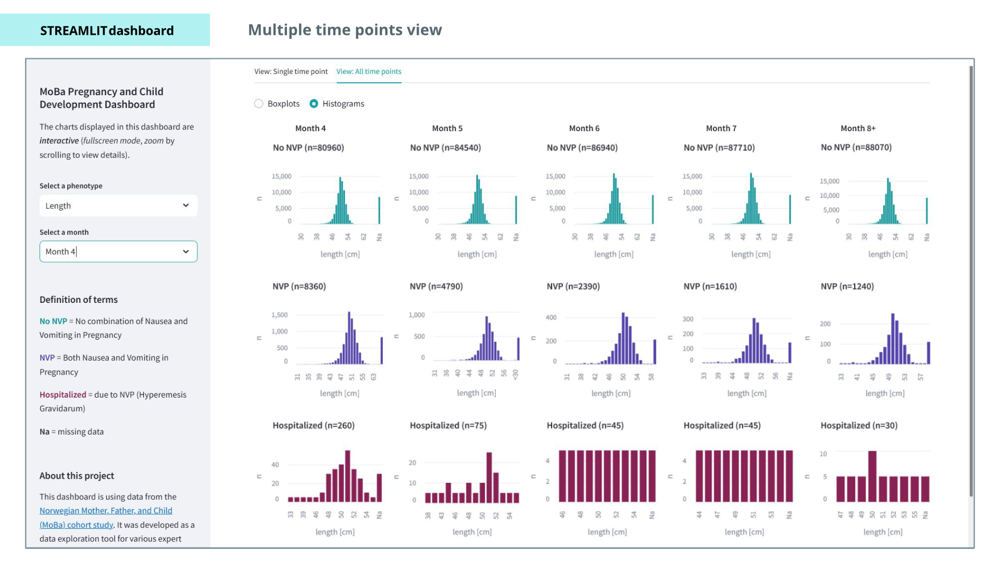

# MoBa Pregnancy and Child Development Dashboard

An interactive visual analytics dashboard for exploring possible relationships between maternal health during pregnancy and child development outcomes using data from the Norwegian Mother, Father and Child Cohort Study (MoBa).

The project was developed through an interdisciplinary and iterative design process using Streamlit and Vega-Altair to support exploratory analysis of complex and sensitive medical cohort data.

Developed in collaboration with PhD candidate Roxanne Ziman at the University of Bergen.

---

## 💡 Motivation

This project explores how interactive visualization can support exploratory analysis of potential relationships between maternal health during pregnancy and child development outcomes.

Through this project, I explored dashboard design, visual analytics workflows, and the challenges of communicating complex longitudinal medical data through interactive visualization.

---

## ✨ Features

- interactive Altair-based data visualizations
- filtering by phenotype, e.g., child's length at birth
- filtering maternal health categories by pregnancy month
- combining multiple coordinated visualization types, incl. small multiples
- visualizing child development metrics from birth up to eight years
- explanatory text and clear instructions to guide the user
- semantic color coding for maternal health categories
- expandable views for comparative visualizations across multiple dimensions
- integrated raw data table view

---

## 📸 Preview

### Sketching Design Ideas
 
Early exploration of dashboard layouts and visualization concepts.

### Mock-up

 
Figma was used to create mock-ups for discussing dashboard structure, visualization ideas, and iteration notes together with a domain expert.

### Dashboard Design

- sidebar including filtering options, definitions, and instructions
- dashboard content for a single time point organized in quadrants

- dashboard content for multiple time points using small multiples arranged in a matrix layout
  
---MoBa – Norwegian Mother, Father and Child Cohort Study

## 🧬 MoBa Data Availability

Data from the Norwegian Mother, Father and Child Cohort Study (MoBa) are managed by the Norwegian Institute of Public Health and are subject to ethical approval and GDPR regulations.

Due to participant privacy restrictions, the dataset cannot be publicly redistributed. Researchers seeking access must apply through the Norwegian health data services platform and obtain approval from the appropriate ethics committees and data owners.

Links: [MoBa – Norwegian Mother, Father and Child Cohort Study](https://www.fhi.no/en/ch/studies/moba/)

---

## 🛠 Tech Stack

- Python
- Vega-Altair
- Streamlit
- Figma

---

## 🎨 Design Notes

The project emphasizes:

- neutral clinical visualization design
- readability, contrast, and visual hierarchy
- clear grouping of cohort subgroups through semantic colors

---

## 🔬 Research

This work was presented at the Eurographics Workshop on Visual Computing for Biology and Medicine (VCBM) in 2024.
- [The MoBa Pregnancy and Child Development Dashboard: A Design Study](https://doi.org/10.2312/vcbm.20241194)

---

🧠 What I Learned

This project gave me practical experience with:

- designing and structuring interactive dashboards with Streamlit
- coordinating development tasks within an interdisciplinary collaboration
- balancing independent implementation work with collaborative design decisions
- translating sensitive medical datasets into interactive exploratory visualizations
- balancing clear structure, readability, aesthetics, and usability
- translating sketches and mockups into a functional prototype under time constraints
- iterative design refinement through expert feedback

---

## 🔭 Future Improvements

- additional data dimensions for child development
  - e.g., head circumference, BMI, and psychobehavioral outcomes
- improving visual grouping and use of white space
- exploring the integration of data visualization libraries that allow for greater flexibility in chart customization
- improving responsiveness across device sizes
- enhancing accessibility and interaction patterns

---

## 📄 License

This project is licensed under the MIT License.
Copyright (c) 2026 Beatrice Budich and Roxanne Ziman
